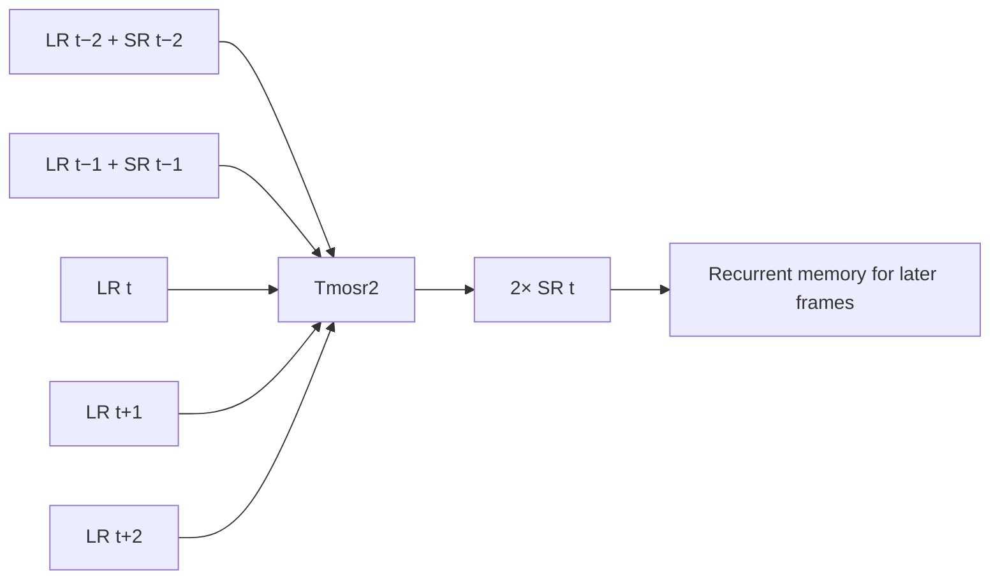

# 🎥 Tmosr2

**2× temporal upscaling for real-life videos — made by [xyether](https://github.com/XYETHER) 🤍**

Tmosr2 looks at nearby video frames and reuses its previous upscaled results. Its non-temporal backbone is **[MoSRv2 by umzi2](https://github.com/umzi2/MoSRV2)**, with temporal fusion and recurrent feedback added by xyether.

[](https://colab.research.google.com/github/XYETHER/Tmosr2/blob/main/Tmosr2.ipynb)
[](LICENSE)

> 🧪 **Still in development:** results aren't perfect. You may see artifacts, softer details or flicker, and quality can vary from one clip to another. Try it on your own footage and check the result.

## 👀 See it in action

The example below uses the supplied real-life clip. The input is **1280×720** and the model output is **2560×1440**. No frame interpolation, sharpening filter or other enhancement was added.


**A closer look:** the input crop is enlarged with bilinear resizing for comparison; the other crop comes directly from Tmosr2's output.


| Original clip | Tmosr2 result |
| :---: | :---: |
| [▶️ Watch / download input](https://github.com/XYETHER/Tmosr2/releases/download/v1.0.0/input_preview.mp4) | [▶️ Watch / download 2× output](https://github.com/XYETHER/Tmosr2/releases/download/v1.0.0/Tmosr2_preview.mp4) |

Both videos keep all **52 source frames** and their original timing, including the final hold. The images are examples of this checkpoint, not a quality benchmark.

## 🚀 Try it in Colab

1. Open the **[Colab notebook](https://colab.research.google.com/github/XYETHER/Tmosr2/blob/main/Tmosr2.ipynb)**.
2. Select **Runtime → Change runtime type → T4 GPU**.
3. Run **✨ Setup Environment**, then **🚀 Upscale**.
4. Upload a video and download your result. That's it! 🎉

### 🎛️ What do the settings mean?

| Setting | What it does |
| --- | --- |
| `video_path` | Leave it empty to upload, or paste the path of a video already in Colab. |
| `Speed_Boost` | Keeps the model input within 720p. Turn it off to use input up to 1080p. Larger inputs are resized first. |
| `Force_1080p` | Resizes the finished video to fit 1920×1080. |
| `codec` | H.264 works in more players; H.265 is another compression option. Both use GPU encoding. |
| `crf_value` | Lower values mean less compression and bigger files. This controls NVENC's constant-quality setting. |
| `auto_download` | Starts downloading the finished video automatically. |

💡 The model produces **2× the resolution it receives**. Speed Boost can reduce large inputs first. Audio is kept as AAC when present. Processing uses temporary PNG frames, so long videos need enough runtime disk space.

## 📦 Model downloads

Get the **[weights, ONNX models and T4 engines from the release](https://github.com/XYETHER/Tmosr2/releases/tag/v1.0.0)**.

| File | For |
| --- | --- |
| `Tmosr2_2x.safetensors` | Original EMA checkpoint for the PyTorch architecture. |
| `Tmosr2_2x_recurrent.onnx` | The supplied seven-input recurrent model. |
| `Tmosr2_2x_seed.onnx` | Spatial bootstrap used to initialize recurrent memory. |
| `Tmosr2_2x_*_T4.engine` | Prebuilt FP16 engines for T4 + TensorRT 11.0.0.114. |
| `SHA256SUMS.txt` | Checksums for the release files. |

The Colab notebook downloads verified engines automatically. It doesn't build engines or run ONNX conversion during setup. The PyTorch source is available for other hardware.

<details>
<summary><strong>🔬 How the temporal architecture works</strong></summary>

Each output uses five RGB input frames and two earlier, floating-point SR predictions:



- MoSRv2 supplies the spatial stem, 24 body blocks and pixel-shuffle head.
- Temporal fusion combines center-frame features with neighbor differences. Three residual depthwise mixing blocks use dilations 1, 2 and 3.
- Two feedback branches use earlier SR residuals relative to bilinear-upscaled LR, with learned gates and motion gates.
- The spatial `image_only` path seeds memory at the start of a clip or detected scene. At boundaries, LR neighbors are replicated.
- Raw SR tensors feed the next step **before** clamping, resizing or encoding. State resets at detected cuts, and neighbor windows stay inside that segment.
- The cut detector is a simple thumbnail-difference heuristic; it can miss cuts or trigger on fast motion.
- The model needs two future frames. It is an offline video model, with two frames of look-ahead.

**Tensor contract:** RGB float32 in `[0,1]`, NCHW, batch 1 for the release engines. LR tensors share `[1,3,H,W]`; feedback tensors are `[1,3,2H,2W]`.

| ONNX input order | Tensor |
| --- | --- |
| 1 | `older_lr` = LR[t−2] |
| 2 | `older_hr` = SR[t−2] |
| 3 | `previous_lr` = LR[t−1] |
| 4 | `previous_hr` = SR[t−1] |
| 5 | `current_lr` = LR[t] |
| 6 | `next_lr` = LR[t+1] |
| 7 | `later_lr` = LR[t+2] |

The release engines have landscape and portrait profiles: minimum 32 pixels per LR dimension, maximum long side 1920 and short side 1080. Odd dimensions are reflect-padded during inference and cropped back at 2×.

The released checkpoint is the supplied **phase-4 EMA, iteration 3829**, publicly named **Tmosr2**. It was trained on VFHQ-derived, DPID-downsampled 2× pairs. There is no validated temporal-quality benchmark or claim of superior temporal consistency in this release.

</details>

<details>
<summary><strong>🛠️ Run locally or export the model</strong></summary>

Install PyTorch for your hardware, the packages in `requirements.txt`, and FFmpeg. Download the checkpoint into `models/`.

```bash
pip install -r requirements.txt
python tmosr2_video.py input.mp4 output.mp4 --backend torch --codec libx264
```

The portable PyTorch backend uses CUDA when available and otherwise CPU. For GPU encoding, use `--codec h264_nvenc` or `--codec hevc_nvenc`. Use `--full-resolution` to disable the 720p speed limit, or `--force-1080p` to cap the finished output.

Export both ONNX graphs:

```bash
pip install onnx
python tools/export_onnx.py models/Tmosr2_2x.safetensors --output-dir models
```

Rebuild the T4 engines offline on a T4 with TensorRT 11.0.0.114:

```bash
pip install tensorrt==11.0.0.114 onnx onnxconverter-common
python tools/build_t4_engines.py --model-dir models
python tmosr2_video.py input.mp4 output.mp4 --backend trt
```

See [validation.json](validation.json) for the tested runtime, checkpoint/ONNX comparison, recurrent FP16 comparison and full-video checks. This records the tested environment; it does not guarantee every future Colab runtime or input will behave identically.

</details>

## 🤍 Credits & license

- **[xyether](https://github.com/XYETHER)** — temporal architecture additions, model weights, notebook and release.
- **[umzi2](https://github.com/umzi2)** — the base **[MoSRv2 non-temporal architecture](https://github.com/umzi2/MoSRV2)**, licensed under MIT.
- **[traiNNer-redux](https://github.com/the-database/traiNNer-redux)** — training framework and backbone compatibility code; its Apache-2.0 notice is retained.
- The notebook layout is adapted from **[Xyether Anime Upscaler](https://github.com/XYETHER/Xyether-Anime-Upscaler)**.

Tmosr2's temporal code, weights and notebook are released under **[MIT](LICENSE)**. Upstream notices are preserved in [NOTICE](NOTICE) and [licenses/](licenses/). Example footage is separate from the code/model license.
